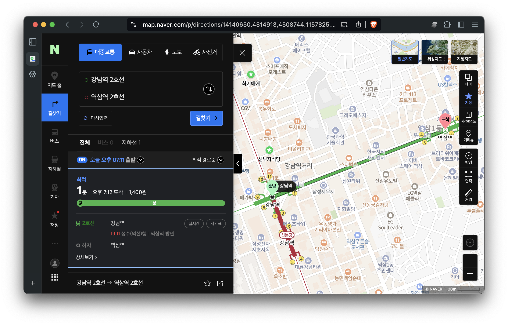
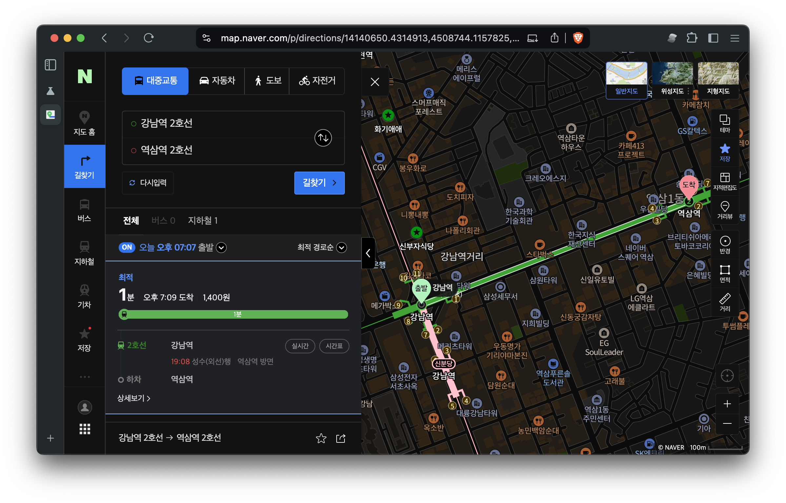
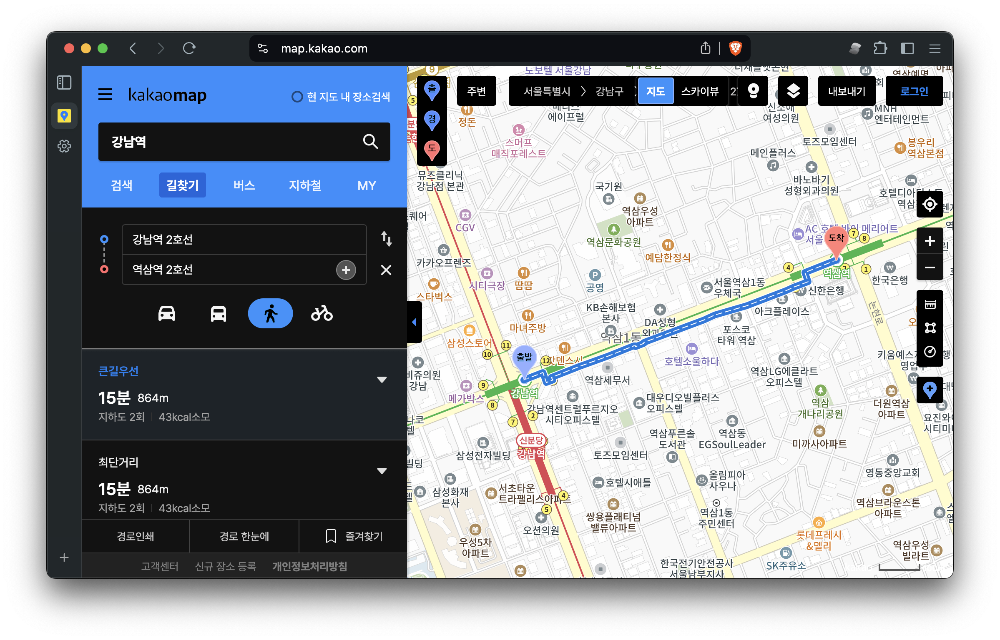
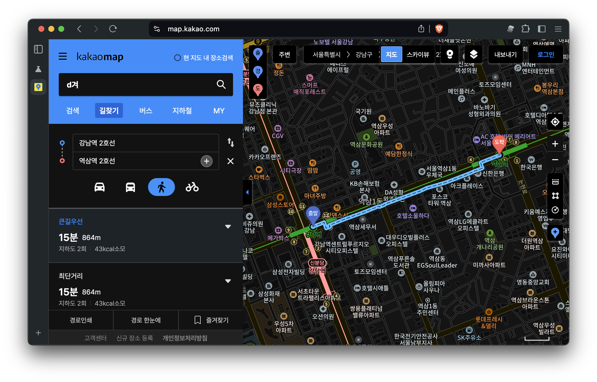
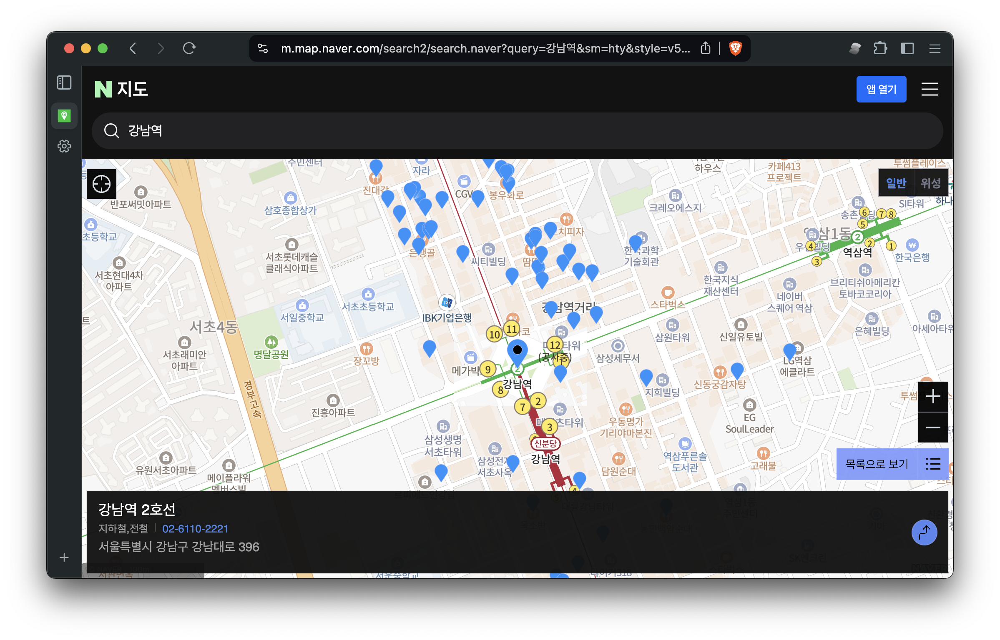
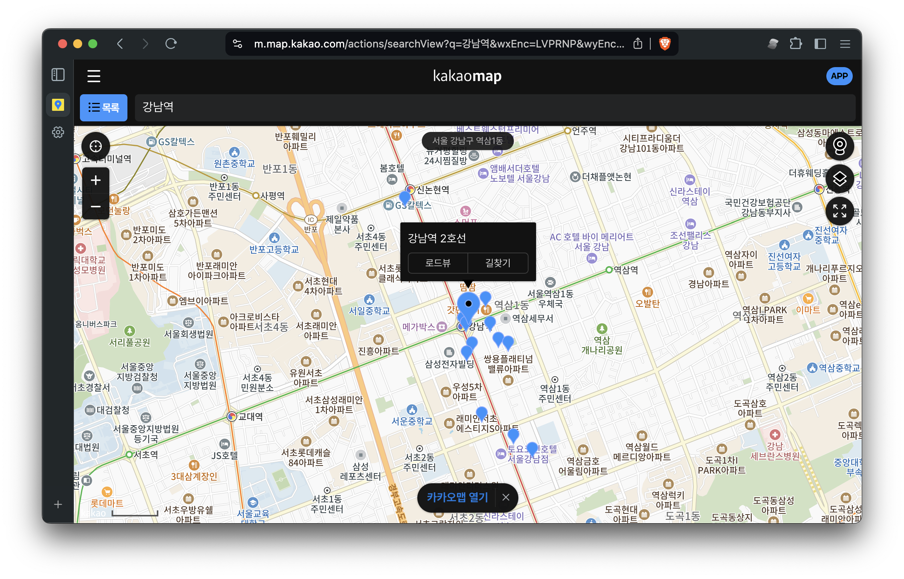
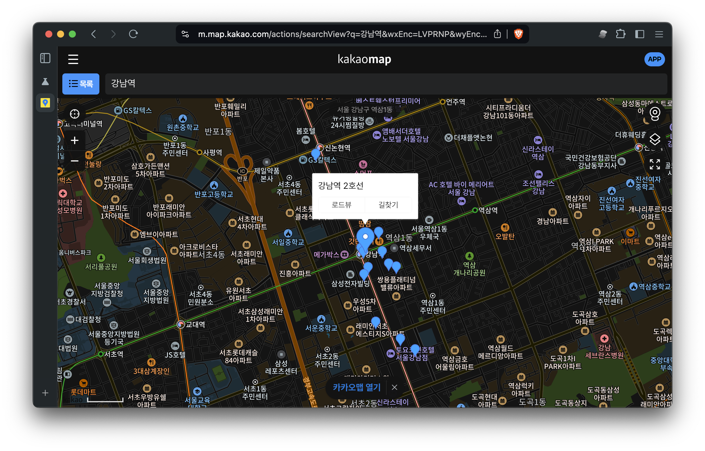

# k-map-dark-filter

광고차단 필터를 사용하여 네이버 / 카카오 지도 웹버전에서 지도 영역을 색반전해서 다크모드처럼 보여줍니다.

## 만든 이유

대부분 전자기기를 다크모드로 이용하는데, 네이버 / 카카오 지도는 웹이든 앱이든 다크모드를 지원하지
않습니다. 뿐만 아니라, chrome 의 강제 다크모드를 사용하는 경우에도 지도 부분은 밝게 나와서
밤에 눈뽕을 당하게 되죠. 앱버전은 수정을 못 하는 관계로 아쉽게나마 웹버전을 수정하고자 만들었습니다.

## 사용법

### 준비

위 필터를 사용하려면

- chrome://flags#enable-force-dark 을 설정한 브라우저
  - e.g. chrome, kiwi, cromite, brave, samsung internet..?, etc.
- UBlock Origin 또는 호환되는 필터를 사용할 수 있는 브라우저

를 준비합니다.

기본적으로 네이버 지도와 카카오 지도는 color-scheme 에 dark 가 없기 때문에 enable-force-dark 를 enabled 등으로 설정할 수 있는데, 이 때 지도 영역을 제외한 나머지만 색반전이 됩니다.

### UBlock Origin

Adblock Plus 나 ublock origin 설정에 들어간 다음에 custom filters 에서 주소를 입력하는 부분에 아래 주소를 추가합니다.

```filter
https://raw.githubusercontent.com/lumiknit/k-map-dark-filter/main/k-map-dark.ublock.txt
```

만약 추가 후 제대로 안 되는 것 같다면, 대신에 `k-map-dark.ublock.txt` 파일의 내용을 그대로 복사해서 filter 목록에 추가해서 테스트해보세요.

## 예시

| Kind | Before | After |
|:----:|:------:|:-----:|
| Naver |  |  |
| Kakao |  |  |
| Mobile Naver |  |  |
| Mobile Kakao |  |  |
