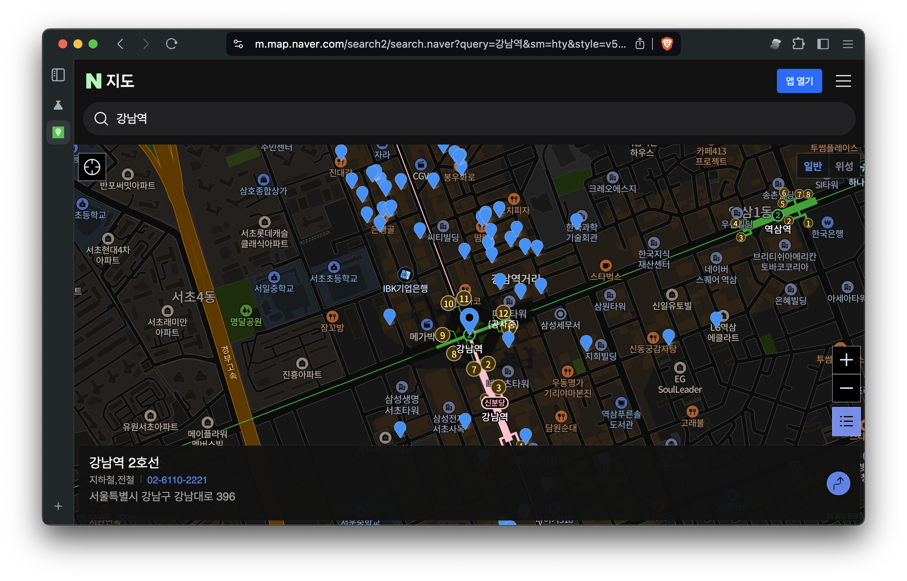

# k-map-dark-filter

광고차단 필터, 또는 사용자 스크립트를 사용하여 네이버 / 카카오 지도 웹버전에서 지도 영역을 색반전해서 다크모드처럼 보여줍니다.

## 만든 이유

개인적으로 대부분 전자기기를 다크모드로 이용하는데, 네이버 / 카카오 지도는 웹이든 앱이든 다크모드를 지원하지 않습니다.
뿐만 아니라 거의 모든 경우 (chrome 의 색반전을 사용하는 경우에도) 지도 부분은 밝게 나와서
밤에 눈뽕을 당하게 되죠.
앱버전은 수정을 못 하는 관계로 아쉽게나마 웹버전을 수정하고자 만들었습니다.

Firefox 등에서는 dark reader filter 를 활용하면 다크모드로 볼 수 있는데,
이에 동기를 얻어서 이 필터를 만들게 되었습니다.

## 사용법

### 준비

위 필터를 사용하려면

- chrome://flags#enable-force-dark 을 설정한 브라우저
  - 이 설정을 마치면 지도를 **제외한** 나머지 부분이 다크모드로 보입니다.
  - e.g. chrome, kiwi, cromite, brave, samsung internet..?, etc.
- ublock origin (또는 호환되는 커스텀 필터) 또는 Greasemonkey (또는 호환되는 user script) 확장
  - Adblock plus 등에서는 필터 규칙이 지원되지 않습니다.

를 준비합니다.

PC 기준으로는 chrome 기반 브라우저에 확장 설치로 가능하며,
안드로이드에서는 kiwi, cromite, brave 등에서는 확인되었습니다.

### UBlock Origin

ublock origin 설정에 들어간 다음에 custom filters 에서 주소를 입력하는 부분에 아래 주소를 추가합니다.

```filter
https://raw.githubusercontent.com/lumiknit/k-map-dark-filter/main/k-map-dark.ublock.txt
```

만약 추가 후 제대로 안 되는 것 같다면, 대신에 `k-map-dark.ublock.txt` 파일의 내용을 그대로 복사해서 filter 목록에 추가해서 테스트해보세요.

### Greasemonkey / Tampermonkey

`monkey` 폴더 안에 있는 스크립트를 모두 추가하고 활성화해주세요.
해당 스크립트는 다크모드가 켜져있는 경우에만 지도를 색반전합니다.

## 예시

| Kind | Before | After |
|:----:|:------:|:-----:|
| Naver |  |  |
| Kakao |  |  |
| Mobile Naver |  |  |
| Mobile Kakao |  |  |
